Poursuivant l'objectif de mieux **rendre visible et compréhensible l'impact environnemental dans les gestes du quotidien**, voici un état des lieux de l'affichage de gaz à effet de serre (GES) dans le secteur des transports. A ce titre, nous interrogeons un expert de l'ADEME, Marc Cottignies, sur la [réglementation en vigueur](https://www.ecologique-solidaire.gouv.fr/information-ges-des-prestations-transport) et nous verrons son application concrète pour les citoyens et citoyennes au travers de quelques services de mobilité.

## Marc, pouvez-vous vous présenter ?

> Marc Cottignies, ingénieur expert au Service Transports et Mobilité de l’ADEME, en charge principalement de 3 thématiques : la quantification de l’impact environnemental des opérations de transport, les engagements volontaires des donneurs d’ordre en transport de marchandises, et le transport aérien.

## Pouvez-vous résumer les éléments clés de la réglementation française sur l'affichage GES dans les transports ?

> On parle plutôt de l’information GES des prestations de transport : l’information n’est pas « affichée », en général, surtout en transport de marchandises.
> Les **prestataires de transport doivent informer leurs clients de la quantité de gaz à effet de serre (GES) correspondant aux prestations proposées ou réalisées**.
> Elle vise à sensibiliser les acheteurs de transport à l’impact environnemental, leur permettre de disposer d’une information environnementale et non seulement du prix ou d’autres considérations comme la durée du voyage, le confort, etc.
> Elle concerne à la fois le transport de voyageurs et de marchandises, le déménagement, tous les modes de transport.
> Après avoir été initialement construite sur un périmètre incluant les transports depuis ou vers l’étranger, l’obligation réglementaire est aujourd’hui réduite aux prestations internes au territoire français.

> En pratique, la réglementation ne fixe que peu de conditions relatives aux modalités de communication de l’information aux clients, si bien que des pratiques variées sont observées : affichage à bord de certains bus, tramways ou métros, information communiquée sur l’application du transporteur, ou sur la facture, ou simplement disponible sur le site web, etc.

## Existe-t-il des règles au niveau européen dont il faut tenir compte ?

> Il n’existe pas à ce jour de réglementation européenne sur ce sujet.
>
> La réglementation française s’est appuyée sur l’état de l’art des normes et travaux européens tels que la norme EN16258:2012, en cours de révision via les travaux de la norme ISO14083 (internationale).

## Selon vous, quelles sont les évolutions discutées à court/moyen terme ?

> Elles sont nombreuses !
>
> Globalement, il faudrait assurer une meilleure mise en œuvre de la réglementation par l’ensemble des acteurs, à la fois en qualité et en quantité.
>
> Qualitativement, c’est d’abord **la communication qui doit être structurée, standardisée afin que l’information parvienne effectivement au client**, dans une forme adaptée. C’est ensuite **la justesse et la précision des valeurs communiquées qu’il faudra améliorer**.
>
> Sur le plan quantitatif, il faudra parvenir à généraliser la quantification des informations et transmission aux clients par les prestataires de transport, et son exploitation par les clients.
>
> La méthodologie pourra être revue pour s’aligner sur la norme ISO14083 lorsqu’elle sera publiée.
>
> Le périmètre d’application pourrait être rétabli à son état d’origine, c’est-à-dire réintégrer toutes les prestations de transport entre la France et les autres pays.
>
> Une vérification externe volontaire chez les prestataires de transport permettrait d’apporter aux clients une meilleure assurance et transparence. Le cadre réglementaire le prévoit, mais la mise en œuvre n’est pas encore possible. Cette situation doit être débloquée.
>
> Notons que l’ADEME développe une solution d’échange de données environnementales entre les acteurs du transport, qui fournit un cadre structurant pour rendre effective et efficace la communication de l’information GES aux clients. La première version de cette plateforme, particulièrement destinée aux transporteurs routiers de marchandises, vient d’être livrée en juin : à découvrir à partir du [portail EVE](https://www.eve-transport-logistique.fr/) (puis « Inscription »).

# En pratique, ca donne quoi ?

Voici un petit échantillon d'exemples réels à la date de l'article de ce que l'on peut voir en tant que citoyen ou citoyenne lorsque l'on cherche ou achète un billet. On y retrouve la grande hétérogénéïté évoquée par Marc Cottignies : **information manquante, peu visible, peu lisible ou compréhensible, affichée après l'acte d'achat, non présente sur tous les modes d'accès (titre papier, smartphone, ordinateur, physique, etc.)**…

### Train

Sur cette plateforme l'information est affichée, mais peu mise en avant et pas expliquée. Est-ce beaucoup "1 kg de CO2" pour ce trajet ? Et par rapport aux autres modes de transport ?
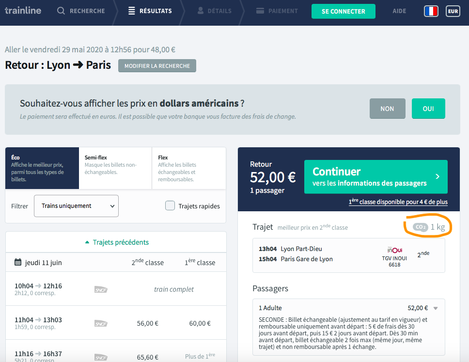

Même chose ici, l'information est visible (à la fois sur ordinateur et sur mobile) mais peu intelligible.

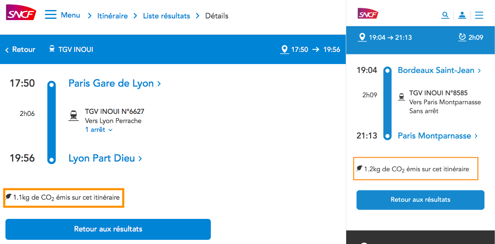

Sur cette autre plateforme de réservation de train, l'information n'est pas affichée lors de la comparaison ni la sélection des offres de transport.

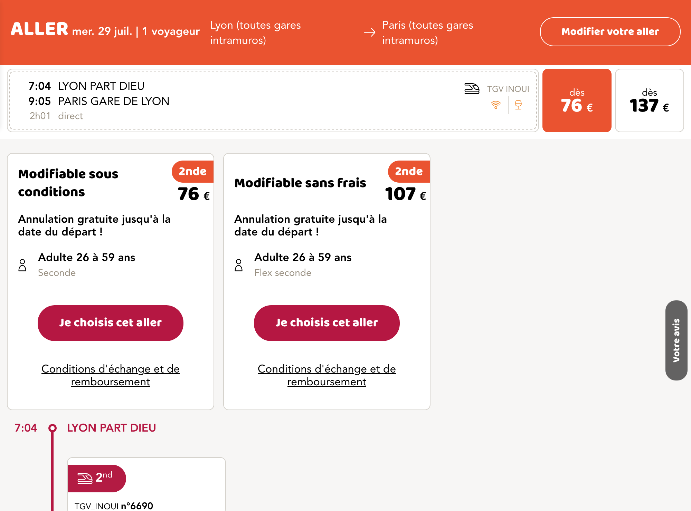

C'est seulement après avoir choisi une offre et en affichant les détails du billet qu'une information est visible, toujours lacunaire et sans plus d'explications pour la comprendre.

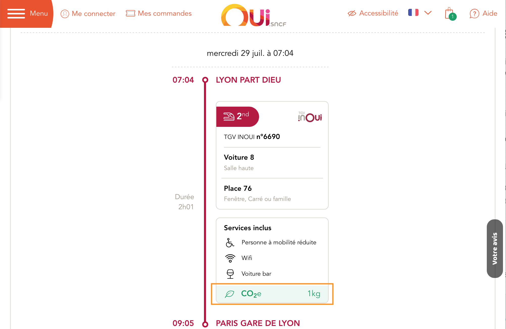

---

### Calcul d'itinéraires

Sur cet outil de cartographie et itinéraire, aucune information n'est visible sur ordinateur ou smartphone.

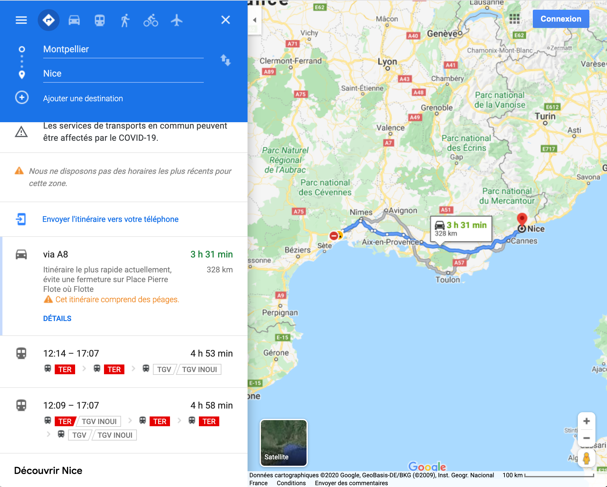

Quand l'information est disponible, comme sur ce comparateur d'itinéraire, l'information est bien affichée sauf pour les itinéraires piéton/vélo (même si la distance ne se prétait pas à ces modes de transport).

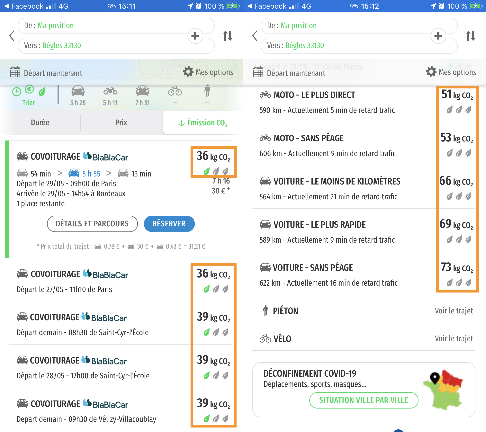

---

### Vélo en libre service

Ici deux applications de vélo en libre service où l'information est affichée, et sur l'une elle est explicitée.

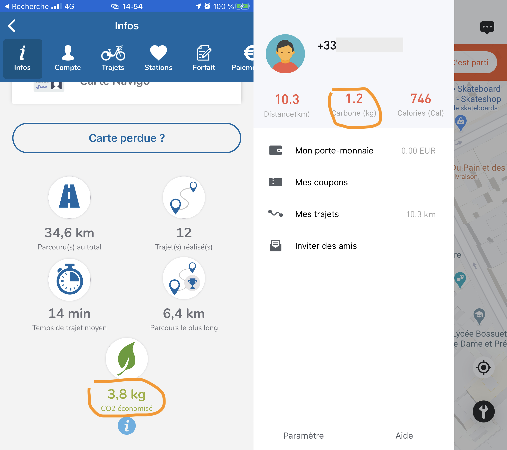

Souvent sur ces usages, il faut avoir téléchargé l'application, puis créé un compte pour accéder au service (comparaison, réservation, etc.), et alors seulement, accéder à l'information GES. Rares sont les services où cette information est accessible en ligne rapidement sans barrière (inscription, téléchargement, achat, etc.). Quant à la compréhension, on voit bien que c'est très secondaire.

---

### Métro

Pour les utilisateurs ou utilisatrices du métro, ce site affiche l'information de l'impact CO2 et donne une comparaison avec le même trajet effectué en voiture. Reste que peu de gens savent si 11 g. ou 786 g. c'est beaucoup ou non. Notre culture sur cet indicateur est vraiment limitée pour appréhender ces informations. Un lien rapide amène sur le [bilan carbone de l'opérateur](https://www.ratp.fr/groupe-ratp/pour-la-planete-et-la-ville/engages-contre-le-changement-climatique) de mobilité.
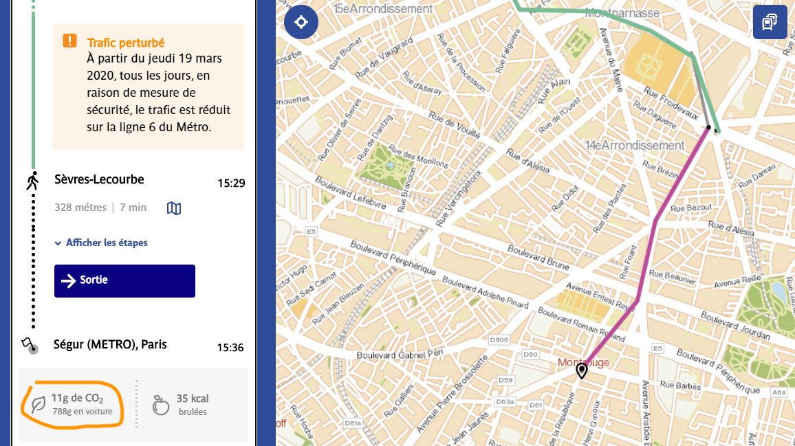

---

### Autocar

Sur cet opérateur de bus, il n'y a pas de calculateur au moment de la comparaison des offres. Au moment de passer la commande, seule est présente la possibilité de compenser les émissions liées.
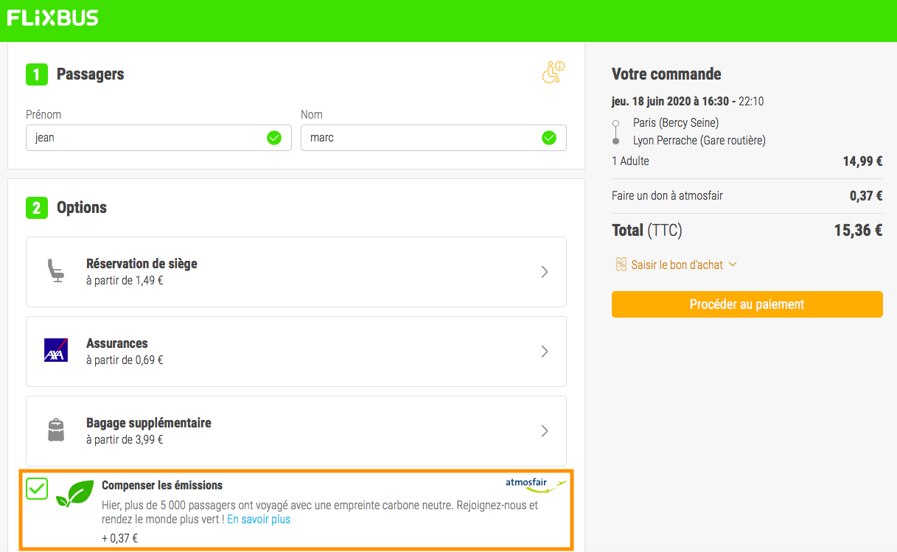

---

### Avion

Dans le secteur aérien, l'information est très variable et peu visible. L'une des compagnies n'affiche aucun chiffre, et communique seulement. Le second affiche le calculateur de l'ICAO tout en bas du billet et de manière bien peu lisible et accessible.

Une autre compagnie propose un [calculateur d'émissions](https://www.corsair.fr/calculateur-co2) au format Excel à télécharger et compléter uniquement pour les marchandises. C'est simple mais ça ne permet pas de calculer les émissions des passagers transportés. Et il n'y a pas d'informations sur les chiffres donnés (source, bilan carbone de l'entreprise, etc.).

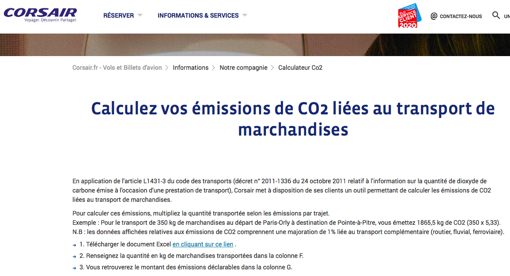

Ici ce billet électronique ne donne pas de chiffres et renvoie sur le site de l'entreprise.
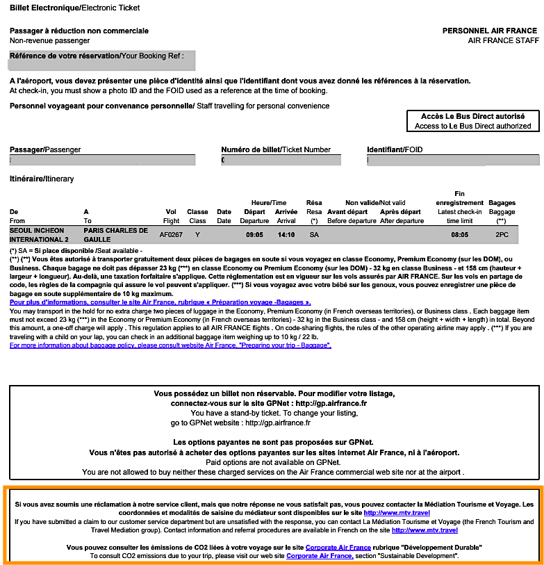
Et lors du parcours d'achat l'information présentée de manière différente selon qu'on est sur mobile ou sur un ordinateur. Sur la qualité de l'information fournie, laissons [Valérie Masson-Delmotte commenter](https://twitter.com/valmasdel/status/1287714996810592257) cet affichage pour le moins très limité.

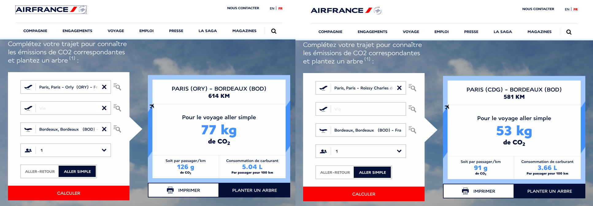

Le lien d'information renvoie vers les actions de compensation et non sur le [calculateur de l'entreprise](https://corporate.airfrance.com/fr/co2/calculateur), bien fait, qui calcule les émissions du trajet.

---

Ce dernier exemple est significatif car il montre que l’information n’est pas fournie à l'usager, c’est à lui d’aller la chercher, la décortiquer, la comprendre (contrairement au prix, durée, etc.). Lorsqu'elle est affichée, l'information est parcellaire (n’inclut pas les émissions liées au carburant en amont de la combustion), limitée, peu intelligible, voire trompeuse. Enfin entre services, on ne compare pas toujours les mêmes choses, il est alors facile de faire des choix en mauvaise connaissance de cause.

On voit donc que l'affichage de l'impact GES doit faire des progrès pour être visible, intelligible et entrer dans l'équation de la mobilité. Alors **si vous travaillez dans le secteur des transports** (comparateur, calculateur d'itinéraire, opérateur de mobilité, etc.) **et avez envie d'éclairer vos communautés d'utilisateurs** (de plus en plus demandeuses et exigentes), **n'hésitez pas à explorer [la section transport](/transport) du site et découvrir [les données](https://github.com/betagouv/ecolab-transport) ou à prendre contact avec nous. Ecolab est là pour **vous aider à intégrer les données d'impact environnemental au sein de vos applications et services\*\* afin de mieux sensibiliser les citoyennes et citoyens et ainsi participer à faire des choix plus éclairés au regard de [l'enjeu](/blog/transport/budget-empreinte-carbone-c-est-quoi).
